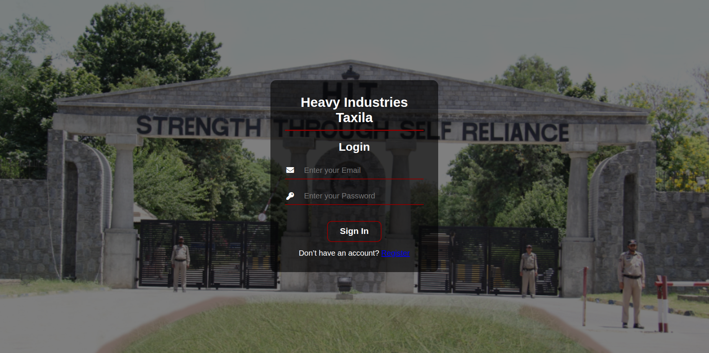
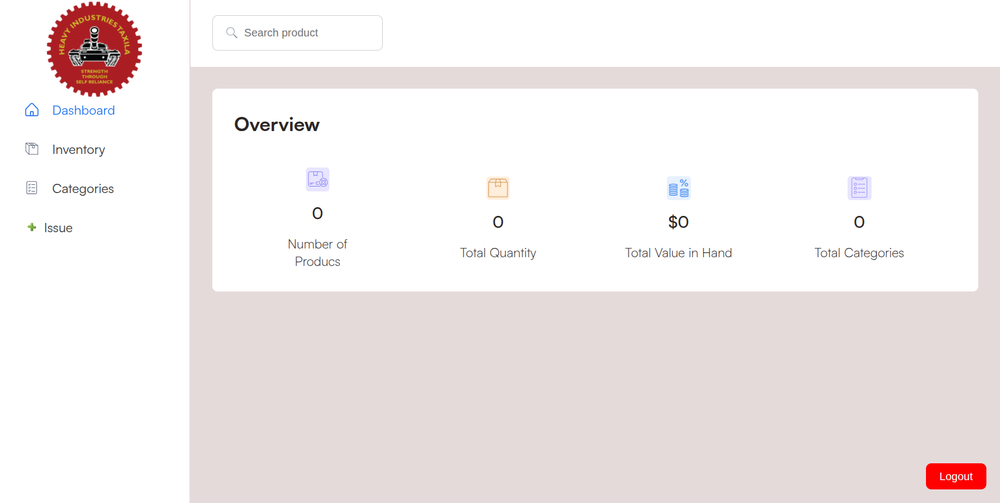
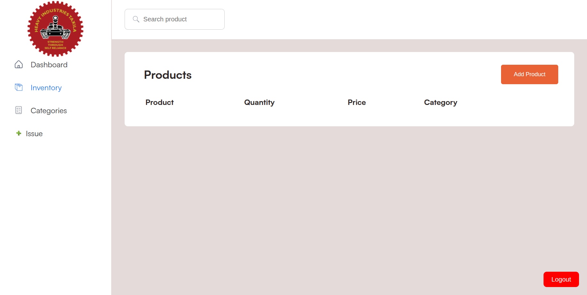
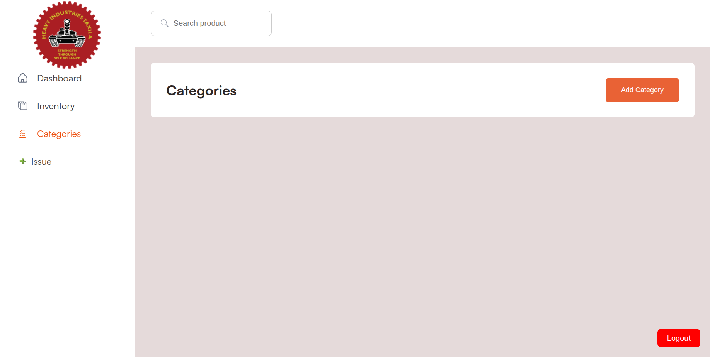
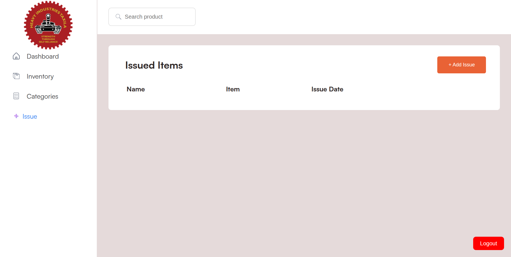

Perfect 👍
Below is a **complete, ready-to-paste `README.md`** updated **exactly** for your screenshots folder and image names.

👉 You can **copy–paste this directly** into your `README.md` in VS Code and commit it.

---

```md
# HIT-inventory-system

## Short Description
**HIT-inventory-system** is a front-end inventory management system developed during my internship period. The project provides a structured user interface for managing inventory items, categories, and issue records, along with a basic authentication flow and dashboard view.

---

## Features
- User login interface
- Dashboard overview
- Inventory management
- Category management
- Issue / item assignment tracking
- Clean and modular front-end structure
- Easy to run as a static web application

---

## Tech Stack
- **HTML5**
- **CSS3**
- **JavaScript (Vanilla)**
- Static server for local development

---

## Screenshots

### Login
<p align="center">
  
</p>

### Dashboard
<p align="center">
  
</p>

### Inventory View
<p align="center">
  
</p>

### Categories View
<p align="center">
  
</p>

### Issue Tracking
<p align="center">
  
</p>

---

## File Structure
```

HIT-inventory-system/
├── assets/                     # Fonts and image assets
├── public/
│   ├── index.html              # Main application entry point
│   └── index1.html             # Alternate entry (testing / layout variant)
├── screenshots/                # Project UI screenshots
│   ├── login.png
│   ├── dashboard.png
│   ├── inventory.png
│   ├── categories.png
│   └── issue.png
├── src/
│   ├── css/
│   │   ├── font.css            # Font definitions
│   │   ├── style.css           # Main application styles
│   │   └── style1.css          # Alternate or page-specific styles
│   └── js/
│       ├── API.js              # API interaction functions
│       ├── app.js              # Application bootstrap logic
│       ├── auth.js             # Authentication handling
│       ├── categoryView.js     # Category UI rendering
│       ├── Dashboard.js        # Dashboard logic
│       ├── InventoryView.js    # Inventory UI and operations
│       └── IssueView.js        # Issue tracking UI

````

**Assumption:** `index.html` is the primary application entry, while `index1.html` is an alternative or experimental layout.

---

## Installation
Clone the repository and run a local static server.

### Option 1: Using Python
```bash
python3 -m http.server 8000
````

### Option 2: Using Node.js

```bash
npx serve .
```

Open the application in your browser:

```
http://localhost:8000/public/index.html
```

---

## Usage

1. Start the local server.
2. Open `index.html` to access the inventory system.
3. Navigate through login, dashboard, inventory, categories, and issue views.
4. Use `index1.html` if you want to test an alternate layout.

---

## Development

* Always use a static server (do not open HTML directly).
* Recommended tools:

  * VS Code **Live Server**
  * `npx live-server`
* Debug using browser DevTools:

  * Console for JavaScript errors
  * Network tab for API requests
  * Elements tab for UI inspection

---

## Contributing

Contributions are welcome.

1. Fork the repository
2. Create a new feature branch
3. Commit your changes
4. Open a pull request

---

## License

This project is licensed under the **MIT License**.

---

## Author

**Syed Samad**
Internship Front-End Project

---

## Next Steps

* Integrate a real backend API
* Add form validation and better error handling
* Implement automated testing and CI/CD

````

---

### ✅ Final step (don’t forget)
After pasting this README:

```bash
git add README.md screenshots
git commit -m "Add README with screenshots"
git push origin main
````

---